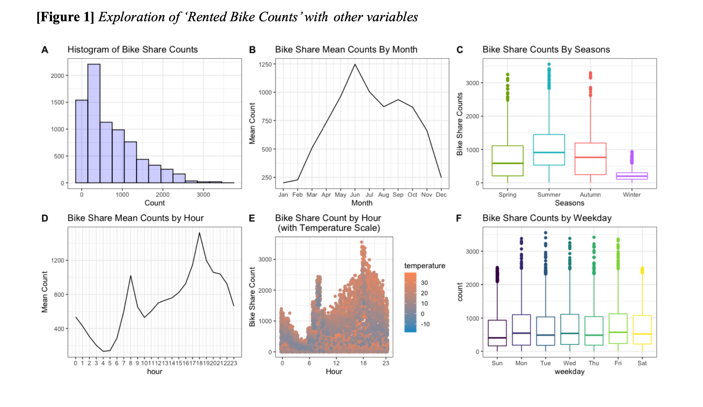
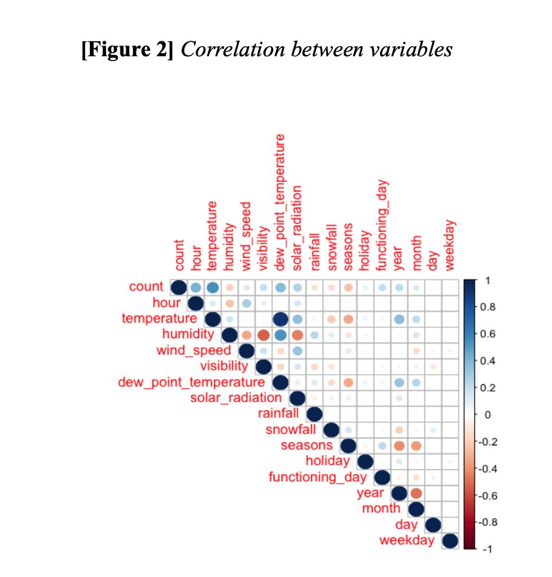
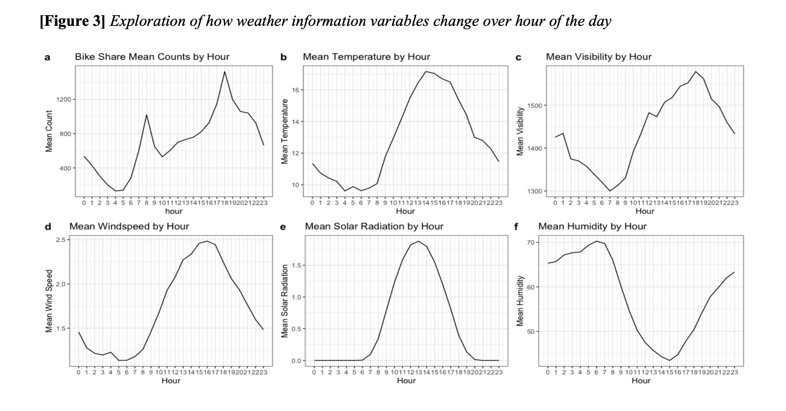
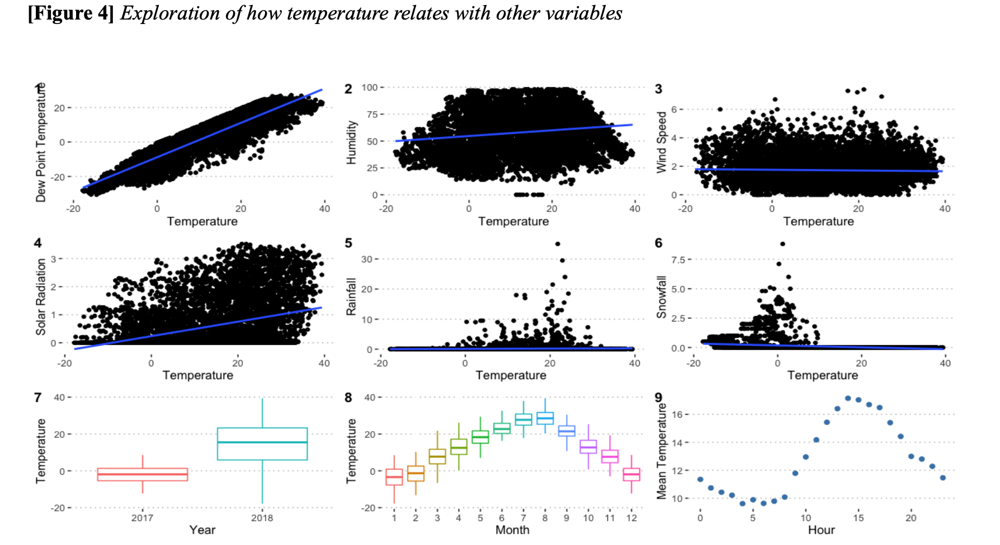
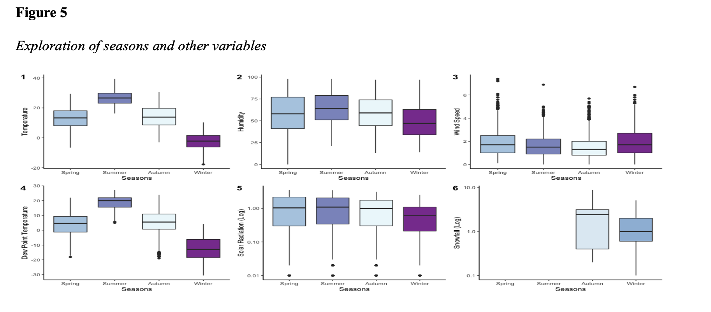
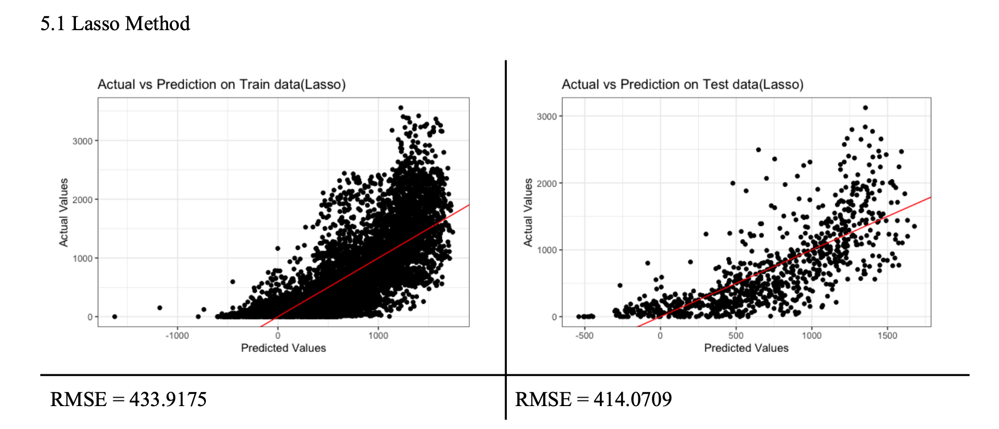
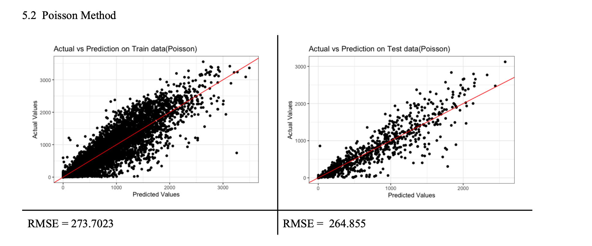
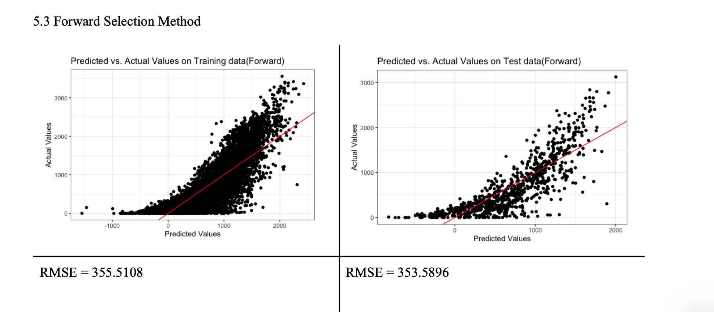

## Seoul Bikeshare 

### 1. Abstract
<dl>
Ddareungi (Korean: 따릉이) is Seoul’s bike sharing system. Seoul introduced Ddareungi to increase the mobility comfort and for eco-environment policy in order to make the rental bike available to the public at the right time. This project overall goal is to make the predictions of rental bike counts by comparing three statistical learning methods ( Lasso, Poisson, Forward Stepwise Selection). These are based on the Exploratory Data Analysis(EDA) with the corresponding weather data and holiday information. This will help Seoul to have a stable supply of rental bikes to the public.
</dl> 

### 2. Dataset

<dl> This project uses ‘Seoul Bike Sharing Demand Data Set’ which can be downloaded from UC Irvine Machine Learning Repository. This data set characteristics is multivariate, associated task is regression, and attribute types include integer and real. There are 8760 records/observations. There are no missing values in this dataset, so I will keep the full dataset for analysis.
Response variable is ‘Rented Bike count’ (Quantitative). Predictor variables are ‘Hour’ (Qualitative), ‘Temperature’ (in Celsius, Quantitative), ‘Humidity’ (in %, Quantitative), ‘Wind speed’ (in m/s, Quantitative), ‘Visibility’ (in 10m, Quantitative), ‘Dew point temperature’ (in Celsius, Quantitative), ‘Solar radiation’ (in MJ/m2, Quantitative), ‘Rainfall (in mm, Quantitative), ‘Snowfall’ (in cm, Quantitative), ‘Seasons’ ( [Spring, Summer, Autumn, Winter], Qualitative), ‘Holiday’ ( [Holiday, No holiday], Qualitative), ‘Functional Day’ ( [NoFunc, Func], Qualitative), ‘year’ (Qualitative), ‘month’ (Qualitative), ‘day’ (Quantitative), ‘weekday’ (Qualitative). ‘Date’ is in year-month-day format (2017-12-01~2018-11-30) so I could not use Date variable as it is. I mutated this date variable into four new variables such as ‘year’, ‘month’, ‘day’,’weekday’. Eventually, there are 16 predictors variables/attributes.
I randomly created a test data set that is approximately 10% of the full dataset and treated the remaining 90% of the data set as the training data. Therefore, I get 876 observations of test data and 7884 observations for train data. Here is the link: https://archive.ics.uci.edu/ml/datasets/Seoul+Bike+Sharing+Demand </dd>

</dl> 

### 3. Exploartory Data Analysis on Training Data

### 4. Statistical Learning Methods

### 5. Conclusion
This project goal is to make the predictions of rental bike counts by comparing three statistical learning methods (Lasso, Poisson, Forward Stepwise Selection). This will potentially provide an important source and information in order to contribute on making eco-environment policy on making the rental bike available to the public at the right time.

